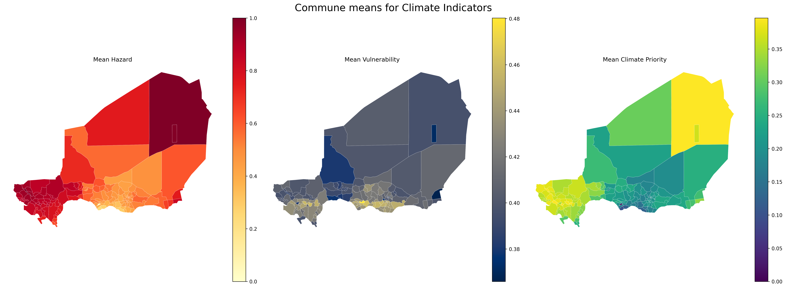
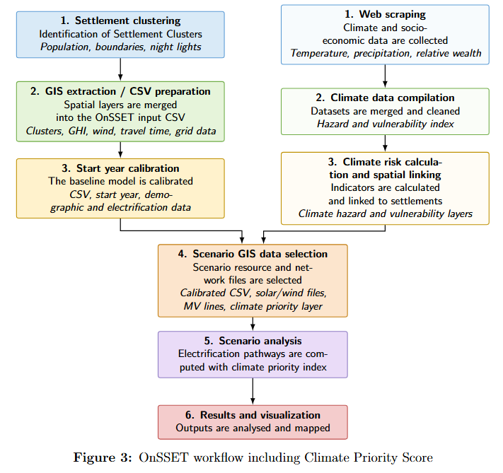

# Summary

The OnSSET climate extension is a fork of the Open Source Spatial Electrification Tool (OnSSET) that adds climate-risk-informed prioritization to spatial electrification planning. OnSSET is a bottom-up, GIS-based electrification model that estimates least-cost electrification options for settlements, including grid extension, mini-grids, and stand-alone systems [@mentis2017lighting; @korkovelos2019role]. The climate extension preserves this techno-economic modelling structure while adding an optional preprocessing workflow that estimates heatwave and drought risk, combines these hazards with vulnerability indicators, and uses the resulting climate priority score to influence the timing of settlement electrification.

The extension is designed for researchers and electrification planners who want to compare conventional least-cost electrification pathways with pathways that prioritize climate-vulnerable settlements earlier. The current implementation focuses on heatwaves and droughts. It affects electrification sequencing only: it does not alter levelized cost of electricity (LCOE) calculations, technology choice, grid-extension logic, demand projection, or investment and emissions accounting. This narrow integration allows climate-informed prioritization to be compared directly with baseline OnSSET scenarios.

# Statement of need

Universal access to affordable, reliable, and sustainable electricity remains a central development objective under Sustainable Development Goal 7 [@un2015sdg]. Geospatial electrification models are widely used to support planning pathways toward universal energy access by comparing grid extension, mini-grids, and stand-alone systems across spatially distributed demand points [@mentis2017lighting; @korkovelos2019role; @ciller2024partitioning]. Among these, the Open Source Spatial Electrification Tool (OnSSET) is commonly used to identify least-cost electrification pathways at settlement level by combining geospatial data with techno-economic assumptions [@mentis2017lighting; @korkovelos2019role].

However, the standard OnSSET workflow does not explicitly incorporate climate risk or social vulnerability into electrification prioritization. This is a limitation because energy-access decisions are not only techno-economic questions, but also distributional and adaptation-related questions. The energy justice literature highlights the importance of considering who benefits from energy-system decisions, who is left behind, and how energy infrastructure can address vulnerability [@sovacool2015energyjustice; @jenkins2016energyjustice]. Similarly, climate adaptation research emphasizes that exposure, vulnerability, and adaptive capacity shape how communities experience climate risk [@ipcc2022impacts].

This limitation is increasingly important in regions affected by recurrent droughts and extreme heat, where electricity access may be critical for water access, cooling, food preservation, health services, communication, and other adaptation-relevant needs [@ipcc2022impacts]. A planning workflow that considers only least-cost electrification sequencing may therefore underrepresent settlements where earlier electrification could have high climate-adaptation value.

Climate-OnSSET addresses this gap by extending OnSSET with a modular climate-risk preprocessing workflow. The extension estimates settlement-level exposure to droughts and heatwaves, combines these hazards with vulnerability indicators, and generates a climate-priority index for electrification sequencing. The extension influences the temporal ordering of electrification across model periods while preserving the original least-cost objective function, technology-selection logic, and techno-economic structure of OnSSET.

Climate-OnSSET enables researchers and planners to compare conventional least-cost electrification pathways with climate-prioritized scenarios under increasing climate stress, without modifying the underlying optimization framework. It is therefore intended as a transparent scenario-analysis tool rather than a replacement for detailed climate-impact assessment or infrastructure-resilience modelling.

# State of the field

OnSSET is a settlement-level electrification planning model designed to estimate least-cost electrification strategies across large geographic areas [@mentis2017lighting; @korkovelos2019role]. It is well suited to national and subnational electrification planning because it represents spatially explicit population, demand, grid distance, renewable resource availability, and other geospatial inputs. Other energy system tools address related but distinct planning problems. OSeMOSYS is an open-source energy system optimization framework for long-term energy planning, typically applied at broader system scales rather than settlement-level electrification sequencing [@howells2011osemosys]. PyPSA and PyPSA-Earth focus on power-system and transmission-network modelling, providing detailed representations of generation, networks, and system operation [@brown2018pypsa; @pypsaearth2022]. CLOVER supports simulation and optimization of community-scale energy systems, particularly mini-grids, with detailed representation of demand, supply, and system operation at local scale [@sandwell2023clover]. HOMER is widely used for hybrid mini-grid and distributed energy-system design, but is proprietary [@homer2022].

The OnSSET climate extension contributes to this field by preserving the settlement-level electrification-planning strengths of OnSSET while adding a transparent climate-priority mechanism. Rather than building a new electrification model from scratch, the extension contributes directly to an existing open-source tool used for geospatial energy-access analysis. The build-versus-contribute rationale is therefore that the research need is not a new power-system optimization model, but a targeted extension of OnSSET’s electrification sequencing logic. The extension allows users to compare baseline OnSSET prioritization with climate-risk-informed prioritization while keeping the underlying LCOE and technology-selection methods unchanged.

# Software design

The extension is designed as an additive preprocessing and prioritization layer around baseline OnSSET. The main climate workflow is implemented in `onsset/climate_algorithm.py`, with hazard-specific calculations implemented in `onsset/climate_calculations/heatwave_calculation.py` and `onsset/climate_calculations/drought_calculation.py`. The climate pipeline is invoked from `runner.scenario(...)` when both a climate-data folder and an administrative-boundary shapefile are supplied. If these inputs are not supplied, the standard OnSSET scenario workflow is preserved.

The preprocessing workflow loads user-supplied climate files, classifies them by temporal resolution and variable type, and dispatches them to the relevant hazard calculation modules. The current implementation uses daily maximum temperature data for heatwave risk and monthly precipitation data for drought risk. Climate grid cells are spatially joined to admin-3 administrative units, and hazard indicators are aggregated to this level. Heatwave risk is estimated from the frequency of high-temperature days, while drought risk is estimated using a Standardized Precipitation Index (SPI) calculation [@mckee1993spi]. The two hazard scores are combined into a compound climate hazard using configurable weights.

The compound hazard is then mapped back to settlements through the admin-3 spatial join. For each settlement, the extension computes:

$$
\mathrm{ClimatePriority} =
\mathrm{ClimateHazard} \times \mathrm{ClimateVulnerability}
$$

where

$$
\mathrm{ClimateVulnerability} =
\frac{(1 - \mathrm{NormalizedRelativeWealth}) + \mathrm{NormalizedTravelHours}}{2}.
$$

Population is deliberately excluded from the priority score because OnSSET’s rollout rule already selects settlements until a cumulative population target is reached in each time step. Including population directly in the climate score would therefore double-count population in both ranking and selection. Instead, the climate priority score changes the order of settlements in the electrification queue, while the existing population target determines how many people are electrified in each period.

The integration point with OnSSET is intentionally narrow. A new prioritization option, `prio_choice = 6`, is added to `SettlementProcessor.pre_selection` in `onsset.py`. Under this option, unelectrified settlements are ordered by descending `ClimatePriority`, after preserving existing OnSSET sorting rules for already electrified settlements and intensification. The standard OnSSET scenario loop then proceeds as before: demand is estimated, off-grid and grid options are evaluated, least-cost technologies are selected, and investment, capacity, and emissions summaries are produced. This design makes the effect of climate prioritization transparent and isolates it from unrelated techno-economic model components.

# Functionality

The OnSSET climate extension allows users to run standard OnSSET scenarios with an additional climate-informed prioritization mode. Users provide the normal OnSSET inputs together with gridded climate data and an administrative-boundary shapefile. Climate data may come from sources such as Copernicus/ERA5 or other gridded climate datasets, provided the data are converted to tabular CSV format before being passed to the model.

The climate loader classifies input files using filename hints that indicate temporal resolution and variable type. For example, daily temperature files can be used for heatwave calculations, while monthly precipitation files can be used for SPI-based drought calculations. The files must contain geographic coordinates and either a date field or year/month fields, together with the relevant temperature or precipitation variable. The administrative-boundary shapefile, recommended at admin-3 level, is used to aggregate gridded climate indicators to administrative units and then map the resulting hazard scores to settlements.

To activate climate-informed sequencing, users set `prio_choice = 6` in the scenario configuration and supply the climate-data folder and administrative-boundary shapefile when running `runner.scenario(...)`. The model then computes heatwave risk, drought risk, compound climate hazard, climate vulnerability, and `ClimatePriority` before running the standard OnSSET scenario loop. The electrification target for each time step remains unchanged, but settlements with higher climate priority are moved earlier in the electrification sequence.

The outputs retain the standard OnSSET result structure and add settlement-level climate columns, including `ClimateRiskHeatwave`, `ClimateRiskDrought`, `ClimateHazard`, `ClimateVulnerability`, and `ClimatePriority`. Users can compare a baseline OnSSET run with a climate-prioritized run by keeping the same scenario assumptions and changing only the prioritization mode.

# Research impact statement

The OnSSET climate extension enables research on how electrification pathways change when climate hazard and vulnerability are included in settlement prioritization. It supports questions such as: Which settlements are electrified earlier under climate-informed sequencing? How does climate-informed prioritization change the spatial distribution of new connections across time? Do aggregate investment, technology mix, grid-extension patterns, or emissions differ when climate-vulnerable settlements are prioritized earlier? Climate priority directly affects electrification timing. It may also affect the resulting pathway indirectly, since earlier electrification changes the evolving grid frontier and can therefore influence grid feasibility in later iterations. These questions are relevant for researchers studying the intersection of energy access, climate adaptation, and infrastructure planning.

The software also has near-term policy relevance. Governmental electrification planners often need to decide not only which technologies are least costly, but also which communities should be reached first under constrained rollout targets. By adding heatwave- and drought-informed prioritization to OnSSET, the extension provides a reproducible way to explore trade-offs between conventional techno-economic rollout strategies and climate-sensitive rollout strategies.

The current implementation should be interpreted as a prioritization tool rather than a full climate-resilience model. Climate hazards do not currently affect technology performance, infrastructure failure probabilities, diesel logistics costs, renewable generation profiles, or asset lifetimes. The software also currently supports heatwave and SPI-based drought prioritization only. These limitations are intentional scope boundaries for the present implementation and point to future extensions, including flood-risk indicators, SPEI-based drought metrics, climate-dependent technology performance, and resilience-adjusted cost assumptions.

# AI usage disclosure

Generative AI tools were used during the preparation of this submission. ChatGPT and the built-in AI agent in Visual Studio Code were used to inspect and summarize the repository structure, identify climate-related code paths, draft documentation, suggest JOSS-readiness improvements, and assist with drafting this paper. The human authors reviewed, edited, and validated the resulting text and remain responsible for all scientific, technical, and scholarly claims. AI tools were not treated as authors and were not used as a substitute for testing, verification, or human review of the software.

# Acknowledgements

This software is a fork of the Open Source Spatial Electrification Tool (OnSSET), originally developed by the OnSSET community and KTH Royal Institute of Technology. The authors thank the upstream OnSSET developers and contributors for making the original tool openly available. The authors also acknowledge the supervisor contributions of Tatiana Gonzalez Grandon and Pedro Crespo del Granado in guiding the development and research framing of the climate extension.

# References
